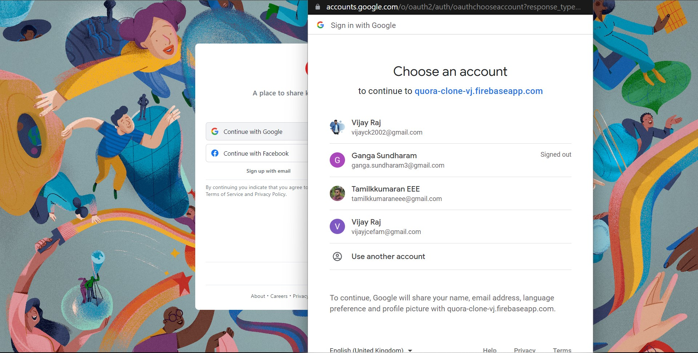

# Quora Clone2.0 🚀💥

A web application which allows you to ask questions and answer to 0ther questions as per your choice.   

 

 

## Preview

| 1. Login page of our Quora2.0                                           |         |
| ----------------------------------------------------------------------- | --------------------------------------------------- |
| 2. Click on `Continue with google` and voila! your Google popup appear. |         |
| 3. Main page of our Quora2.0                                            |          |
| 4. Click on `Add question` and voila! your Question modal is appears.   |  |
| 5. Click on `Answer` and voila! your Answer modal is appears.           |    |

## Thanks for Reading!
